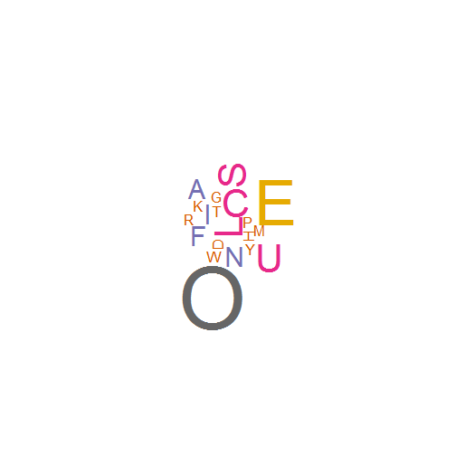

## What do you know about your love of letters?

>1. Most of us know what words are our favorite
  + good
  + chocolate
  + love
  + owesome
>2. And we know letters form words
>3. But our favorite letters are hidden somewhere in our brain.
>4. Let's find them out with this app!

--- 

## Step 1

Give me a list of words that you like:

For example:

```r
favorite.words <- c("Good", "Luck", "Owesome", "Serious", "Play", "Fun", "Fine", "Chocolate")
```
Then, type them out:

```r
paste(favorite.words, collapse = " ")
```

```
## [1] "Good Luck Owesome Serious Play Fun Fine Chocolate"
```

---

## Step 2

You then give the sentence to the Letter Cloud app.  
It first chops the words into letters:

```r
unlist(strsplit(toupper(favorite.words), NULL))
```

```
##  [1] "G" "O" "O" "D" "L" "U" "C" "K" "O" "W" "E" "S" "O" "M" "E" "S" "E"
## [18] "R" "I" "O" "U" "S" "P" "L" "A" "Y" "F" "U" "N" "F" "I" "N" "E" "C"
## [35] "H" "O" "C" "O" "L" "A" "T" "E"
```
Then creates a frequency table from the letters:

```
## 
## A C D E F G H I K L M N O P R S T U W Y 
## 2 3 1 5 2 1 1 2 1 3 1 2 7 1 1 3 1 3 1 1
```

---

## Step 3

Finally, the letters are sorted and filtered:

```
## O E C L S U A F I N D G H K M P R T W Y 
## 7 5 3 3 3 3 2 2 2 2 1 1 1 1 1 1 1 1 1 1
```
Now we know what your favorite letters are. In this example, it is "O". 

---
## A quick map of your brain of letters - Letter Cloud
Here is a letter cloud map. Is this your brain of letters?  
Visit [https://prizmworkshop.shinyapps.io/WordCount/][id] for details!  

 

[id]: https://prizmworkshop.shinyapps.io/WordCount/ 
